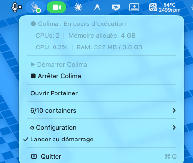

# ColimaBar


macOS menu bar app to manage [Colima](https://github.com/abiosoft/colima) + [Portainer](https://www.portainer.io/) — a lightweight Docker Desktop alternative.



   

---

## Features

- **Start / Stop Colima** — stops automatically when you quit the app
- **Adaptive polling** — 5 s refresh when running, 30 s when stopped
- **Colored icon** — green bubble (running), orange (starting/stopping), white (stopped)
- **Lifecycle notifications** — Starting, Started (with duration + container count), Stopping, Stopped
- **Crash notification** — alert when a container exits unexpectedly
- **Last error in menu** — `⚠ error message` visible directly in menu, clears on next success
- **Containers panel** — rich NSPopover with table view: state, name, image, status, ports, CPU%, RAM columns
- **Sortable columns** — click any header to sort by name, ports, CPU%, or RAM
- **Container search** — filter containers by name in real time
- **Container actions** — Start / Stop / Restart / Logs / Shell per selected container
- **Shell into container** — opens `docker exec -it <name> sh` in Terminal
- **Container filter** — toggle All / Running only (persisted)
- **Per-container CPU & RAM** — live stats per row: CPU%, used / limit (%) — refreshed every 5 s
- **Real-time aggregate CPU & RAM** — totals + global RAM% shown in panel header
- **Health check status** — `●` colored indicator (green/yellow/red) per container showing health check state
- **Clickable port URLs** — each port number in the panel is a link, click opens `http://localhost:PORT` in browser
- **CPU/RAM sparklines** — mini area chart history (up to 20 points) shown in detail zone when a container is selected
- **Image management** — "Images" tab: list all images with size and date, pull new images, delete existing ones
- **Volume management** — "Volumes" tab: list all volumes with size, prune unused volumes
- **Exposed ports** — host port numbers shown per container
- **Copy container ID** — one click copies the full container ID to clipboard
- **Quick logs** — opens `docker logs -f` in Terminal
- **Portainer integration** — auto-opens after Colima starts, installs if missing
- **docker system prune** — `🗑 Prune Docker…` with confirmation dialog
- **Settings popover** — replaces the Configuration submenu, includes all options
- **Profiles** — Minimal (1 CPU / 2 GB), Dev (2 CPU / 4 GB), Heavy (4 CPU / 8 GB)
- **CPU / Memory / Disk fine-tuning** — individual presets in Settings
- **Named Colima instances** — configure the active instance name (default, dev, prod…)
- **Auto-start Colima** — optional: start Colima automatically when the app launches
- **Colima update detection** — `🔄 Colima X.Y.Z update available` when brew has a newer version
- **French / English** — follows system language, manual toggle in Settings
- **Launch at login** — app only, Colima auto-start is a separate opt-in setting

## Changelog

See [CHANGELOG.md](CHANGELOG.md) for full version history.

## Roadmap

No planned features at this time.

---

## Requirements

- macOS 13 (Ventura) or later
- Apple Silicon Mac (M1/M2/M3)
- Xcode Command Line Tools
- Homebrew with `colima` and `docker`

## Install

```bash
# 1. Install dependencies
brew install colima docker

# 2. Clone and build
git clone git@github.com:DamienGdn/colimaBar.git
cd colimaBar
make install

# 3. Launch
open /Applications/ColimaBar.app
```

> **Gatekeeper warning:** The app is ad-hoc signed. Right-click → Open → Open anyway on first launch.

## Usage

| Action | How |
|--------|-----|
| Start Colima | Click icon → ▶ Start Colima |
| Stop Colima | Click icon → ■ Stop Colima |
| View containers | Click icon → N/M containers → (opens panel) |
| Search containers | Panel → search field |
| Filter containers | Panel → All / Running toggle |
| Start/stop a container | Panel → select container → Start or Stop |
| Restart a container | Panel → select container → Restart |
| Shell into a container | Panel → select container → Shell |
| View container logs | Panel → select container → Logs |
| See per-container stats | Panel → select any running container |
| Copy container ID | Panel → select container → Copy ID |
| Open Portainer | Click icon → Open Portainer |
| Install Portainer | Click icon → Install Portainer… (shown when missing) |
| Prune Docker | Click icon → 🗑 Prune Docker… (shown when running) |
| Open Settings | Click icon → ⚙ Paramètres → |
| Apply a profile | Settings → Profiles → Minimal / Dev / Heavy |
| Change CPU / Memory / Disk | Settings → CPUs / Memory / Disk |
| Set Colima instance name | Settings → Colima Instance |
| Auto-start Colima | Settings → Auto-start Colima on launch |
| Change language | Settings → Language |
| Launch at login | Settings → Launch app at login |
| Upgrade Colima | Click icon → 🔄 update item (shown when available) |
| View images | Panel → Images tab |
| Pull an image | Panel → Images tab → type name → Pull |
| Delete an image | Panel → Images tab → select → Delete |
| View volumes | Panel → Volumes tab |
| Prune volumes | Panel → Volumes tab → 🗑 Prune volumes… |

Portainer runs at **https://localhost:9443** (accept self-signed certificate on first visit).

## Build commands

```bash
make build    # compile release binary
make bundle   # create ColimaBar.app
make install  # bundle + install to /Applications
make clean    # remove build artifacts
```

## Run tests

```bash
swift run ColimaBarTests
```

## Reset Portainer credentials

```bash
docker rm portainer
docker volume rm portainer_data
docker run -d -p 8000:8000 -p 9443:9443 --name portainer --restart=always \
  -v /var/run/docker.sock:/var/run/docker.sock \
  -v portainer_data:/data portainer/portainer-ce:latest
```

Open https://localhost:9443 to create a new admin account.

## Architecture

```
Sources/
├── ColimaBarCore/               # Pure Foundation library (testable)
│   ├── ShellRunner.swift        # Process execution + Homebrew PATH injection
│   ├── ColimaState.swift        # State model + ResourceUsage + DockerContainer
│   ├── DockerContainer.swift    # Docker container model + ports parser + health
│   ├── DockerImage.swift        # Docker image model
│   ├── DockerVolume.swift       # Docker volume model
│   ├── ColimaManager.swift      # Polling, start/stop/prune, container/image/volume commands
│   ├── ColimaConfig.swift       # CPU/memory/disk/instance preferences + ColimaProfile presets
│   └── Localization.swift       # FR/EN strings + language preference
└── ColimaBar/                   # AppKit executable
    ├── main.swift               # NSApplication entry point
    ├── AppDelegate.swift        # App lifecycle, SMAppService, notifications
    ├── StatusBarController.swift # NSStatusItem, menu, icon, crash detection
    ├── SparklineView.swift      # NSView area chart for CPU/RAM history
    ├── ContainersPanelViewController.swift # Containers/Images/Volumes NSPopover
    └── SettingsPanelViewController.swift   # Settings NSPopover (profiles, resources, language)
Tests/
└── ColimaBarTests/              # Custom test runner (no Xcode required) — 74 tests
Resources/
├── Info.plist                   # LSUIElement=true, bundle metadata
├── AppIcon.icns                 # App icon (all sizes)
├── colimabar.png                # Menu bar icon @1x
└── colimabar@2x.png             # Menu bar icon @2x
```
